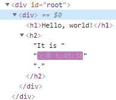
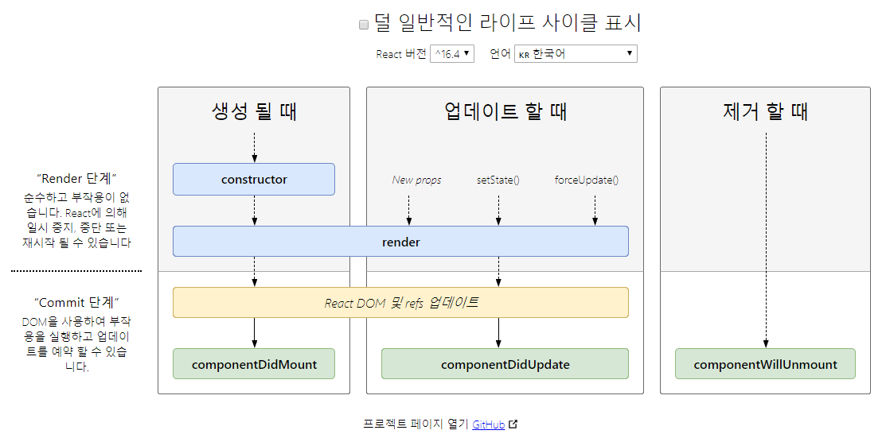

# 2일차

3. 엘리먼트 렌더링
4. Component와 Props
5. State와 생명주기

<br />

## 3. 엘리먼트 렌더링

### 개요

**React 엘리먼트**는 React 앱의 가장 작은 단위로 화면에 표시할 내용을 기술합니다.  
엘리먼트는 아래와 같은 특징이 있습니다.

- **<span style="color: #ecf542">변경된 부분만 업데이트</span>**
- React DOM은 React 엘리먼트와 일치하도록 DOM을 업데이트
변경된 부분만 업데이트
  - React DOM은 해당 엘리먼트와 그 자식 엘리먼트를 이전의 엘리먼트와 비교해 필요한 경우에만 DOM을 업데이트
- **브라우저 DOM 엘리먼트**와 달리 **React 엘리먼트**는 일반 객체 입니다.
  - **브라우저 DOM 엘리먼트** : **<span style="color: #4ca8c7">브라우저 DOM 엘리먼트</span>**
  - **React 엘리먼트** : **<span style="color: #4ca8c7">Native Object</span>**

> 💡 **<span style="color: #4ca8c7">Host Object</span>** : 실행 환경에서 제공하는 객체  
> 💡 **<span style="color: #4ca8c7">Navtive Object</span>** : 언어 자체에서 제공되는 객체

<br/>

```jsx
/* ===================  React =================== */
function tick() {
  const element = (
    <div>
      <h1>Hello, world!</h1>
      <h2>It is {new Date().toLocaleTimeString()}.</h2>
    </div>
  );

  // React 엘리먼트를 루트 DOM 노드에 렌더링
  ReactDOM.render(element, document.getElementById('root'));
}

// setInterval() 콜백을 이용해 초마다 ReactDOM.render() 를 호출
setInterval(tick, 1000);
```

아래 사진과 같이 텍스트가 변하는 부분만 변합니다.

<p align="center">
  
</p>

<br/>

## 4. Components and Props

React는 **<span style="color: #4ca8c7">Components</span>** 와 **<span style="color: #4ca8c7">props</span>** 를 사용하여 UI를 구성합니다.

<br/>

### 컴포넌트

**<span style="color: #4ca8c7">컴포넌트</span>** 란 재사용할 수 있는 기능을 단위별로 캡슐화하는 리액트의 기본 단위입니다.

- **props** 를 통해 입력을 받을 수 있습니다.
- 자신의 출력에 다른 컴포넌트를 참조할 수 있다.(**컴포넌트 합성**)
- 컴포넌트를 여러개의 작은 컴포넌트로 나눌 수 있다.

<br/>

### props

**<span style="color: #4ca8c7">props</span>** 란 속성을 나타내는 **읽기 전용** 데이터입니다.

읽기 전용인 이유는 모든 React 컴포넌트는 **<span style="color: #4ca8c7">순수 함수</span>** 처럼 동작해야 한다고 권장합니다.

```jsx
function Welcome(props) {
  // props.name = "이를 진행하면 순수함수가 안됨"

  return <h1>Hello, {props.name}</h1>;
}

const element = <Welcome name="JaeHak" />
```

> **<span style="color: #4ca8c7">순수 함수</span>**
>
> - 입력이 같을 때, 출력이 같음
> - _**Side-Effect**_(의도치 않게 변환)가 없다.

<br/>

### 컴포넌트 작성

**컴포넌트**(Components)를 정의하는 방법은 아래와 같이 2가지가 존재합니다.

- **함수 컴포넌트**
  - 기존 javascript의 함수처럼 선언
  - 예제
  
    ```jsx
    /* 결과 :  <h1>Hello, HAK</h1> 이 렌더링됨 */

    // 매개변수가 props가 됨
    const FunctionalComponent = (props) => {
      return <h1>Hello, {props.name}</h1>;
    };

    ReactDOM.render(
      <FunctionalComponent name="HAK" />,
      document.getElementById("root")
    );
    ```

- **클래스 컴포넌트**
  - *ES6 문법* 의 `class`를 사용
  - `render()` 를 사용해 렌더링
  - 예제
  
    ```jsx
    /* 결과 :  <h1>Hello, JAE</h1> 이 렌더링됨 */

    class ClassComponent extends React.Component {
      render() {
        // this.props 가 묵시적으로 props가 됩니다.
        return <h1>Hello, {this.props.name}</h1>;
      }
    }

    ReactDOM.render(
      <ClassComponent name="JAE" />,
      document.getElementById("root")
    );
    ```

<br/>

> ⚠️ 컴포넌트의 이름은 항상 대문자로 시작합니다.

<br/>

> ⚠️ 만약 **클래스 컴포넌트**에서 `constructor()`(생성자)을 수정해야하는 경우
>
> 생성자 내의 매개변수(props)명은 마음대로 넣을 수 있지만 그 외에는 `this.props` 로 접근 해야합니다.
>
> ```jsx
> class MyComponent extends React.Component {
>   // 함수 컴포넌트처럼 props 명을 커스텀하게 할 수 있습니다.
>   // 생성자 내에서는 커스텀 props명을 사용하지만
>   // 그 외는 props 는 this.props 로 접근해야합니다.
>   constructor(SOME_PROS) {
>     // 부모 객체를 생성 하지 않으면
>     // 이 클래스에 this.props 가 생성자 내에 정의되지 않아 버그 발생!
>     super(SOME_PROS);
>     // ...    
>   }
>
>   render() {
>     // this.props 값은 생성자의 SOME_PROS 가 된다.
>     return <h1>Hi~ {this.props}</h1>
>   }
> }
> ```

<br/>

### 컴포넌트 합성

컴포넌트에 다른 컴포넌트를 여러번 참조할 수 있습니다.

```jsx
function Welcome(props) {
  return <h1>Hello, {props.name}</h1>;
}

function App() {
  return (
    <div>
      <Welcome name="Hi" />
      <Welcome name="my name" />
      <Welcome name="is" otherProps="HAK" />
    </div>
  )
}
```

> React 공식 문서에서는 컴포넌트 합성을 통해 많은 코드를 재사용할 수 있도록
> 코드를 쪼개어 작성하는 것을 권장합니다.

<br/>

## 5. State and Lifecycle

### state

`state`라는 객체를 만들어 *mutable* 한(변경가능한) 데이터를 넣을 수 있습니다.

다만, `state`를 직접 변경하면 컴포넌트가 다시 렌더링 되지 않기 때문에 `state`를 직접 변경하면 안됩니다.  
→  `setState()`를 통해 변경해야합니다.

```jsx
import React from "react";           // 이를 해줘야 JSX 사용 가능

class App extends React.Component {
  // state를 선언
  state = {
    count: 0
  };

  add = () => {
    /* state를 직접 변경 이 코드는 사용하면 안됩니다. */
    // this.state.count++;

    /* setState() 를 통한 state 변경 */
    // current는 this.state를 가리킴
    this.setState(current => ({ count: current.count + 1 }));
  };

  render() {
    return  (
    <div>
      <h1>The num: {this.state.count}</h1>
      <button onClick={this.add}>Add</button>
    </div>
    );
  }
}
```

<br/>

### 라이프 사이클

react는 컴포넌트가 마운트(Virtual DOM에 삽입) 된 직후를 구분하는 **라이프 사이클**이라는 것을 가집니다.

<p align="center">
  
</p>

이러한 **라이프 사이클**에 따라 생명주기 메서드를 이용하여 컴포넌트를 역동적으로 조작할 수 있습니다.

<br />

### 생명주기 메서드

**클래스 컴포넌트** 사용시 아래의 메서드로 컴포넌트가 생성(*Mouning*)

메서드|설명
:--:|--
`componentDidMount()` | - 컴포넌트가 마운트된 직후, 즉 트리에 삽입된 직후에 호출<br/>- DOM 노드가 있어야 하는 초기화 작업을 실행하면 좋음<br/>- **예)** 네트워크 요청
`componentWillUnmount()` | - 컴포넌트가 마운트 해제되어 제거되기 직전에 호출<br/>- 여기서 setState()를 호출하면 안됨(다시 렌더링 안되므로)<br/>- **예)** 타이머 제거, 네트워크 요청 취소
`componentDidUpdate()` | - 갱신이 일어난 직후에 호출<br/>- 이 메서드는 최초 렌더링에서는 호출되지 않음<br/>- **예)** 이전과 현재의 props 를 비교하여 네트워크 요청을 보내는 작업

- **예제**

```jsx
import React from "react";

class Clock extends React.Component {
  constructor(props) {
    super(props);
    this.state = {date: new Date()};
  }

  // 컴포넌트가 마운트된 직후 실행
  componentDidMount() {
    this.timerID = setInterval(
      () => this.tick(),
      1000
    );
  }

  // 마운트 해제시 바로 직전에 호출
  componentWillUnmount() {
    clearInterval(this.timerID);    // setInterval() 행위를 삭제
    console.log("이제 '틱' 거리지 않습니다.");
  }

  tick() {
    console.log("틱");
    this.setState({
      date: new Date()
    });
  }

  render() {
    return (
      <div>
        <h1>Hello, world!</h1>
        <h2>It is {this.state.date.toLocaleTimeString()}.</h2>
      </div>
    );
  }
}

ReactDOM.render(
  <Clock />,
  document.getElementById('root')
);
```

1. `<Clock />`가 `ReactDOM.render()`로 전달되었을 때 React는 Clock 컴포넌트의 constructor를 호출
2. React는 Clock 컴포넌트의 `render()` 를 호출
3. Clock 출력값이 **DOM**에 삽입되면, React는 `componentDidMount()` 메서드를 호출

> ⚠️ 인스턴스가 마운트 해제(컴포넌트 삭제)되고 나면, 절대로 다시 마운트 되지 않습니다.

<br/>

### state, props 비동기적 업데이트

`this.props`와 `this.state`가 비동기적으로 업데이트될 수 있기 때문에 다음 `state`를 계산할 때 해당 값에 의존하면 안된다.

아래와 같이 하면 업데이트 실패할 수 있습니다.

```jsx
// 업데이트에 실패할 수도 있음
this.setState({
  counter: this.state.counter + this.props.increment,
});
```

아래와 같이 바꿔야합니다.

```jsx
// 이전 state를 첫번째 인자로 받고
// 업데이트 적용된 시점의 props를 두번째 인자로 받는다.
this.setState((state, props) => ({
  counter: state.counter + props.increment
}));

// 혹은 아래와 같이 함수로 표현 가능
this.setState(function(state, props) {
  return {
    counter: state.counter + props.increment
  };
});
```

<br/>

### state 업데이트 주의사항

`setState()`를 호출할 때 React는 제공한 객체를 현재 `state`로 병합한다.

```jsx
import React from "react";

class MyClass extends React.Componenet {
  constructor(props) {
      super(props);
      this.state = {
        posts: [],
        comments: []
      };
    }

  componentDidMount() {
    fetchPosts().then(response => {
      // posts 는 바뀌지만 commenets는 그대로
      this.setState({
        posts: response.posts
      });
    });

    fetchComments().then(response => {
      // comments 는 바뀌지만 posts는 그대로
      this.setState({
        comments: response.comments
      });
    });
  }
}
```

