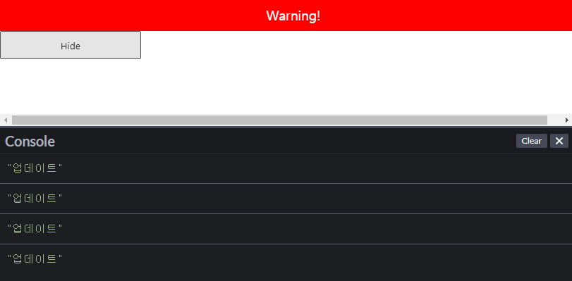

# 3일차

6. 이벤트 처리하기
7. 조건부 렌더링
8. 리스트와 Key

<br/>

## 6. 이벤트 처리하기

react 엘리먼트에서 이벤트를 처리하는 방식은 DOM과 유사합니다.
그러나 아래와 같은 차이점이 있습니다.

### 이벤트명을 소문자 대신 **camelCase** 를 사용

```jsx
// 함수형 컴포넌트
const ELE = () => {
  return (
    {/* onclick 이 아닌 onClick 을 사용해야합니다. */}
    <button onClick={() => clickButton()}>
      React Button
    </button>
  );
}
```

<br/>

### 함수로 이벤트 핸들러 전달

이벤트 핸들러는 HTML과 달리 **항상 함수 객체**로 지정

- **HTML**

  ```html
  <button onclick="clickButton()">
    HTML Button
  </button>
  ```

- **react**

  ```jsx
  // 함수형 컴포넌트
  const ELE = () => {
    return (
      <button onClick={() => clickButton()}>
        React Button
      </button>
    );
  }
  ```

<br/>

### `event.prevetDefault()`로 기본동작 방지

이벤트 발생시 브라우저에 의해 자동으로 수행되는 동작들이 있습니다.

- 링크를 클릭하면 해당 URL로 이동
- 폼 전송 버튼을 클릭하면 서버에 폼이 전송
- 마우스 버튼을 누른 채로 글자 위에서 커서를 움직이면 글자가 선택

이 동작을 실행하지 않기를 원하면 아래의 두가지 방법이 있습니다.

- `event.prevetDefault()`를 호출하는 방법
- 이벤트 핸들러 함수에서 `false` 를 반환

react에서 `false` 를 반환해도 기본 동작을 방지 못합니다.

- **HTML** : `return false` 를 명시하면 기본 동작을 방지합니다.

  ```HTML
  <!-- 클릭시 새 페이지를 여는 것을 방지 -->
  <a href="#" onclick="console.log('Clicked!!!'); return false;">
    Click me
  </a>
  ```

- **react** : `event.preverntDefault()` 를 호출하여 기본 동작 방지

  ```jsx
  // 클래스 컴포넌트
  
  class ActtionLink extends React.Component {
    constructor() {
      super();
      this.state = {
        name: "HAK",
        num: 1
      }

      // handleClick 안의 this 값을 이 클래스에 바인딩함
      this.handleClick = this.handleClick.bind(this);
    }

    handleClick(e) {
      // preventDefault() 사용
      e.preventDefault();
      console.log('클래스 컴포넌트 클릭');
    }
    
    render() {
      return (
        <a href="#" onClick={this.handleClick}>
          Click me
        </a>
      );
    }
  }
  ```

  JSX 콜백 안에서 `this`의 의미에 대해 주의해야 합니다.  
  JavaScript에서 클래스 메서드는 기본적으로 바인딩되어 있지 않습니다.  
  따라서, `bind()`를 사용하여 `this` 값을 바인딩 해줘야합니다.

  > 📖 `Function.bind(thisArgs)` : Function 안에서 this 값을 thisArgs 로 설정한 새로운 함수를 반환
  >
  > 더 자세한 내용은 [MDN](https://developer.mozilla.org/ko/docs/Web/JavaScript/Reference/Global_Objects/Function/bind)을 참조

  > 📖 **브라우저의 이벤트 기본동작**에 대해서 더 자세한 내용은 [모던 JavaScript 튜토리얼](https://ko.javascript.info/default-browser-action)을 참조

  <br/>

  ```jsx
  // 함수 컴포넌트

  function ActionLink() {
    function handleClick(e) {
      // preventDefault() 사용
      e.preventDefault();
      console.log('함수 컴포넌트 클릭');
    }
    return (
      <a href="#" onClick={handleClick}>
        Click me
      </a>
    );
  }
  ```

  예제들에서 `e`는 **<span style="color: #4ca8c7">합성 이벤트</span>** 입니다.
  
  <br/>

  > 📖 **<span style="color: #4ca8c7">합성 이벤트</span>**
  >
  > 브라우저에 따라 이벤트 처리가 조금씩 다릅니다.  
  > 예를 들어 이벤트 객체를 가져올 때 브라우저마다 틀립니다.
  >
  > - *IE8* : `event.srcElement`
  > - *Chrome, Safari, Firefox* : `event.target`
  >
  > <br/>
  >
  > react는 브라우저 내장 이벤트를 **[SyntheticEvent 객체](https://ko.reactjs.org/docs/events.html)** 로 래핑하여 모든 브라우저에서 동일한 이벤틀 처리를 보장합니다.  
  > **SyntheticEvent 객체**가 래핑한 이벤트 객체를 **합성 이벤트**라고 합니다.  
  > 이 **합성 이벤트**를 사용함으로써 이벤트 리스너를 등록하기 위해 `addEventListener()`를 호출할 필요가 없습니다.

<br/>

### 이벤트 핸들러에 인자 전달

이벤트 핸들러에 인자를 전달하는 방법은 아래와 같습니다.

```jsx
{/* React 이벤트를 나타내는 e 인자가 ID 뒤에 두 번째 인자로 전달하는 예제 */}

{/* => 를 이용하는 방법, 명시적으로 인자를 전달 */}
<button onClick={ (e) => this.deleteRow(id, e) }>Delete Row</button>

{/* Function.prototype.bind 사용, 추가 인자가 자동으로 전달된 함수 객체 반환 */}
<button onClick={ this.deleteRow.bind(this, id) }>Delete Row</button>
```

<br/>

## 7. 조건부 렌더링

react 에서 조건에 따라 원하는 컴포넌트를 렌더링을 할 수 있습니다.

### 기본형

`if`문을 이용하여 조건부 렌더링을 할 수 있습니다.

```jsx
function Greeting(props) {
  const isLoggedIn = props.isLoggedIn;

  // if 문을 이용하여 반환하는 컴포넌트 다르게 함
  if(isLoggedIn) return <UserGreeting />;
  else return <GuestGreeTing />;
}
```

<br/>

### 엘리먼트 변수 사용

엘리먼트를 저장하기 위해 변수를 사용할 수 있습니다.

```jsx
class LoginControl extends React.Component {
  constructor(props) {
    super(props);

    this.handleLoginClick = this.handleLoginClick.bind(this);
    this.handleLogoutClick = this.handleLogoutClick.bind(this);
  }

  handleLoginClick() {
    this.setState({
      isLoggedIn: true
    });
  }

  handleLogoutClick() {
    this.setState({
      isLoggedIn: false
    });
  }

  render() {
    const isLoggedIn = this.state.isLoggedin; // 로그인 유뮤
    let button;                               // 엘리먼트 변수

    if(isLoggedIn) {
      button = <LogoutButton onClick={this.handleLogoutClick} />;
    } else {
      button = <LoginButton onClick={this.handleLogoutClick} />;
    }

    return <div>{ button }</div>;
  }
}

ReactDOM.render(
  <LoginControl />,
  document.getElementById("root");
)
```

<br />

### if 구문을 인라인으로 표현

**JSX**에서 `{}`를 이용해 표현식을 넣을 수 있습니다.
표현식안에서 `%%` 을 사용하면 조건부 렌더링 구문을 간단하게 표기할 수 있습니다.

- `{ 조건문 && 표현식 }` : 조건식이 **true**인 경우 표현식으로 평가
- `{ 표현식 && 조건문 }` : 조건식이 **false**인 경우 표현식으로 평가

```jsx
function Example(props) {
  const msg = props.intputMsg;
  
  return (
    <div> 
    {
      msg.length > 5 &&
      <h3>true 일 때 렌더링 {msg}</h3>
    }
    {
      <h3>false 일 때 렌더링{msg}</h3> &&
      msg.length > 5
    }
    </div>
  );
}
```

<br/>

### if-else 구문을 인라인으로 표현

`if-else` 구문은 **삼항 연산자**를 이용합니다. 아래의 형태로 사용합니다.

`조건문 ? 표현식_1 : 표현식_2`

```jsx
render() {
  const isLoggedIn = this.state.isLoggedIn;
  return (
    <div>
      The user is <b>{isLoggedIn ? <LogInPage /> : <ErrorPage />}</b> logged in.
    </div>
  );
}
```

<br/>

### 특정 컴포넌트 감추기

다른 컴포넌트에 의해 렌더링되는 컴포넌트를 감추는 경우 렌더링 결과를 출력하는 대신 `null` 을 반환합니다.

`null`을 반환하면 컴포넌트가 업데이트 될 수 있어도 마운트 해제가 되는 것은 아닙니다.

```jsx
function WarningBanner(props) {
  if (!props.warn) {
    // null을 반환해 렌더링을 안하게 한다.
    return null;
  }

  return (
    <div className="warning">
      Warning!
    </div>
  );
}

class Page extends React.Component {
  constructor(props) {
    super(props);
    this.state = {showWarning: true}
    this.handleToggleClick = this.handleToggleClick.bind(this);
  }

  handleToggleClick() {
    this.setState(prevState => ({
      showWarning: !prevState.showWarning
    }));
  }
  
  componentDidUpdate() {
    console.log("업데이트");
  }
  
  componentWillUnmount() {
    console.log("컴포넌트 삭제");
  }
  
  render() {
    return (
      <div>
        <WarningBanner warn={this.state.showWarning} />
        <button onClick={this.handleToggleClick}>
          {this.state.showWarning ? 'Hide' : 'Show'}
        </button>
      </div>
    );
  }
}
```

위 결과의 사진은 아래와 같습니다.

<p align="center">
  
</p>

<br/>

## 8. 리스트와 Key

### 개요

react 에서 배열을 엘리먼트 리스트로 만드는 방법은 JavaScript 에서 `map()` 을 사용하는 방식과 유사합니다.

- **JavaScript**

  ```jsx
  const numbers = [1, 2, 3, 4, 5];
  const doubled = numvers.map((number) => number * 2);
  console.log(doubled);
  ```

- **React**

```jsx
const numbers = [1, 2, 3, 4, 5];
const listItems = numbers.map((number) => <li>{number}</li>);

React.render(
  <ul>{listItems}</ul>,
  document.getElementById("root")
);
```

> ⚠️ 위의 react 예제를 실행하면 각 리스트 항목에 key 값을 넣어야한다는 경고가 발생합니다.  
> key에 대한 설명은 아래 챕터에 있습니다.

<br/>

### Key 속성

**key 속성**는 엘리먼트 리스트를 만들 때 포함디어야 하는 문자열 속성입니다.
**key 속성**의 특징은 아래와 같습니다.

- **key 속성**는 react가 어떤 항목을 변경, 추가 또는 삭제할지 식별하는 것을 돕는다.
- 고유성을 부여하기 위해 배열 안의 각 엘리먼트에 지정해야한다.
- 키 값은 고유한 값(문자열 등)으로 설정해야한다.

```jsx
const numbers = [1, 2, 3, 4, 5];
const listItems = numbers.map((number) => 
  {/* key 설정 */}
  <li key={number.toString()}>
    {number}
  </li>
);

React.render(
  <ul>{listItems}</ul>,
  document.getElementById("root")
);
```

> ⚠️ **리스트의 인덱스 값을 key로 하는 것은 안티패턴**
>
> 리스트의 인덱스 값을 key로 사용할 수 있습니다.  
> 그러나 이는 고유한 값을 가지는 것에 대해 위험요소가 됩니다.

<br/>

### key로 컴포넌트 추출

key는 주변 배열의 맥락(*context* )에서만 의미가 있습니다.

```jsx
function MyLi(props) {
  const value = props.value;
  return (
    {/* 여기에는 key를 지정할 필요가 없다. */}
    <li key={value.toString()}>
      {value}
    </li>
  );
}

function List(props) {
  const { numbers } = props;

  return (
    <ul>
      {
        // 여기에 key를 지정해야한다.
        numbers.map(num => <MyLi value={num} />);
      }
    </ul>
  )
}
```

<br/>

### Key는 형제 사이에서만 고유한 값

**key 값**은 같은 형제 사이에서 고유하면 됩니다.
전체 범위에서 고유할 필요는 없습니다.

```jsx
function MyBlog(props) {
  const sidebar = (
    <ul>
      {
        props.posts.map((post) => 
          <li key={post.id}>
            {post.title}
          </li>  
        );
      }
    </ul>
  );

  const content = props.posts.map((post) =>
    <div key={post.id}>
      <h3>{post.title}</h3>
      <p>{post.content}</p>
    </div>
  );

  return (
    <div>
      {/* 키값이 고유하지 않다는 경고가 안나옵니다. */}
      {sidebar}
      {content}
    </div>
  );
}

const posts = [
  {id: 1, title: 'Hello World', content: 'Welcome to learning React!'},
  {id: 2, title: 'Installation', content: 'You can install React from npm.'}
];

ReactDOM.render(
  <Blog posts={posts} />,
  document.getElementById('root')
);
```
