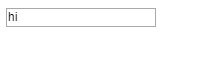
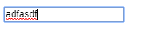

# 4일차

9. 폼
10. state 끌어올리기

<br/>

## 9. 폼
ㄴ

HTML의 `<input>`, `<textarea>`, `<select>` 같은 **폼 엘리먼트**는 사용자의 입력에 따라 자신의 state를 관리 및 업데이트 합니다.

```html
<form>
  <label>
    Name
    <input type="text" name="userName" />
  </label>
  <input type="submit" value="Submit" />
</form>
```

javascript 함수로 input 값을 얻고 폼의 제출을 처리하는 추가적인 과정을 거쳐야합니다.

그러나 react의 경우 **제어 컴포넌트**라는 기술을 통해 입력값, 제출 처리 등을 한 번에 할 수 있습니다.

> 💡 `name` 속성은 **input 양식 컨트롤의 이름**입니다.

<br/>

### 제어 컴포넌트

**제어 컴포넌트**란 react에 의해 값이 제어되는 **입력 폼 엘리먼트** 입니다.

- `setState()`를 사용하여 state 속성을 업데이트
- 제어 컴포넌트에 의해 react state는 신뢰 가능한 단일 출처가 됨

```jsx
// 제어 컴포넌트 예시

class NameForm extends React.Component {
  constructor(props) {
    super(props);
    this.state = {value: ''};

    this.handleChange = this.handleChange.bind(this);
    this.handleSubmit = this.handleSubmit.bind(this);
  }

  handleChange(event) {
    this.setState({value: event.target.value})
  }

  handleSubmit(evnet) {
    alert("A name was submitted: " + this.state.value);
    event.preventDefault();
  }

  render() {
    return (
      <form onSubmit={this.handleSubmit}>
        <label>
          Name:
          {/* input 이 값이 변하면 state 값 변경 */}
          <input type="text" value={this.state.value} onChange={this.handleChange} />
        </label>
        <input type="submit" value="Submit" />
      </form>
    );
  }
}
```

<br/>

### textarea 태그

**HTML**에서 `<textarea>` 엘리먼트는 텍스트를 자식으로 정의합니다.

```html
<textarea>
  Hello there, this is some text in a text area
</textarea>
```

react에서 `<textarea>`는 `value` 속성으로 텍스트를 나타냅니다.

```jsx
class EssayForm extends React.Component {
  constructor(props) {
    super(props);
    this.state = {
      value: "Please write an essay about your favorite DOM element."
    };

    this.handleChange = this.handleChange.bind(this);
    this.handleSubmit = this.handleSubmit.bind(this);
  }

  handleChange(event) {
    this.setState({ value: event.target.value });
  }

  handleSubmit(evnet) {
    alert("An essay was submmited: " + this.state.value);
    event.preventDefault();
  }

  render() {
    return (
      <form onSubmit={this.handleSubmit}>
        <label>
          Essay:
          <textarea value={this.state.value} onChange={this.handleChange} />
        </label>
        <input type="submit" value="Submit" />
      </form>
    );
  }
}
```

<br/>

### select 태그

HTML에서 `<select>`는 드롭 다운 목록을 만듭니다.
그리고 선택된 `<option>` 에 `selected` 속성이 추가됩니다.

```jsx
<select>
  <option value="grapefruit">Grapefruit</option>
  <option value="lime">Lime</option>
  <option selected value="coconut">Coconut</option>
  <option value="mango">Mango</option>
</select>
```

react에서는 사용자가 선택된 항목을 `<option selected>` 대신
최상단의 `<select>` 에 `value` 속성을 사용하여 `state`를 변경시킵니다.

```jsx
class FlavorForm extends React.Component {
  constructor(props) {
    super(props);
    this.state = {value: "coconut"};
  }

  handleChange(event) {
    this.setState({value: event.target.value});
  }

  handleSubmit(event) {
    alert('Your favorite flavor is: ' + this.state.value);
    event.preventDefault();
  }

  render() {
    return (
      <form onSubmit={this.handleSubmit}>
        <label>
          Pick your favorite flavor:
          {/* 선택 항목을 select 태그의 value 값을 사용 */}
          <select value={this.state.value} onChange={this.handleChange}>
            <option value="grapefruit">Grapefruit</option>
            <option value="lime">Lime</option>
            <option value="coconut">Coconut</option>
            <option value="mango">Mango</option>
          </select>
        </label>
        <input type="submit" value="Submit" />
      </form>
    );
  }
}
```

> `<select>` 에 `mutliple` 옵션을 허용하면 `value` 속성에 배열을 전달할 수 있습니다.
>
> ```jsx
> render() {
>   return (
>     <select multiple={true} value={['B', 'C']}>
>     { /* ... */ }
>   );
> }
> `+
> ```
>
> 좀 더 어려운 예는 아래와 같습니다.
>
> ```js
> class FlavorForm extends React.Component {
>   constructor(props) {
>     super(props);
>     this.state = {value: []};
> 
>     this.handleChange = this.handleChange.bind(this);
>     this.handleSubmit = this.handleSubmit.bind(this);
>   }
> 
>   handleChange(event) {
>     const selected=[];
>     
>     // HTMLSelectElement.selectedOptions
>     // <select>, <optgroup>, <datalist> 의 하위 HTML 요소들 가저옴
>     let selectedOption=(event.target.selectedOptions);
>  
>     for (let i = 0; i < selectedOption.length; i++){
>         // selectedOption.item(i)
>         // i번째 요소
>         selected.push(selectedOption.item(i).value);
>     }
>       
>     this.setState({value: selected});
>     
>     console.log(this.state);
>   }
> 
>   handleSubmit(event) {
>     alert('Your favorite flavor is: ' + this.state.value);
>     event.preventDefault();
>   }
> 
>   render() {
>     return (
>       <form onSubmit={this.handleSubmit}>
>         <label>
>           Pick your favorite flavor:
>           <select value={this.state.value} multiple={true} onChange={this.handleChange}>
>             <option value="grapefruit">Grapefruit</option>
>             <option value="lime">Lime</option>
>             <option value="coconut">Coconut</option>
>             <option value="mango">Mango</option>
>           </select>
>         </label>
>         <input type="submit" value="Submit" />
>         <button onClick={() => {console.log(this.state)}}>console.log</button>
>       </form>
>     );
>   }
> }
> 
> ReactDOM.render(
>   <FlavorForm />,
>   document.getElementById('root')
> );
> ```

<br />

### file input 태그

HTML에서 `<input type="file />` 로 파일을 업로드 할 수 있습니다.

```html
<input type="file" />
```

`<input type="file />` 의 값은 읽기 전용이기 때문에 react 에서는 **비제어 컴포넌트**입니다.

<br/>

### 다중 입력 제어

여러 `input` 엘리먼트를 제어할 때 각 엘리먼트에 `name` 속성으로 `event.target.name` 값을 통해 각 핸들러를 인식할 수 있다.

```jsx
class Reservation extends React.Component {
  constructor(props) {
    super(props);
    this.state = {
      isGoing: true,
      numberOfGuests: 2
    };

    this.handleInputChange = this.handleInputChange.bind(this);
  }

  handleInputChange(event) {
    const target = event.target;
    const value = target.type === "checkbox" ? target.checked : target.value;
    const name = target.name;

    this.setState({
      [name]: target.value
    });
  }
  
  render() {
    return (
      <form>
        <label>
          Is going:
          <input
            name="isGoing"
            type="checkbox"
            checked={this.state.isGoing}
            onChange={this.handleInputChange}
          />
        </label>
        <br />
        <label>
          Numver of guests:
          <input
            name="numberOfGuests"
            type="number"
            value={this.state.numberOfGuests}
            onChange={this.handleInputChange}
          />
        </label>
      </form>
    );
  }
}
```

> 💡 **[계산된 속성명(_computed attribute_ )](https://developer.mozilla.org/ko/docs/Web/JavaScript/Reference/Operators/Object_initializer#%EC%86%8D%EC%84%B1_%EA%B3%84%EC%82%B0%EB%AA%85)**
>
> ES6 구문으로 `[]` 안에 식을 넣어 식이 계산되고 그 결과가 **속성명**으로 사용된다.
>
> ```js
> // 계산된 속성명 (ES6)
> var i = 0;
> var a = {
>   ["foo" + ++i]: i,
>   ["foo" + ++i]: i,
>   ["foo" + ++i]: i
> };
>
> console.log(a.foo1); // 1
> console.log(a.foo2); // 2
> console.log(a.foo3); // 3
>
> var param = 'size';
> var config = {
>   [param]: 12,
>   ["mobile" + param.charAt(0).toUpperCase() + param.slice(1)]: 4
> };
>
> console.log(config); // { size: 12, mobileSize: 4 }
> ```

<br/>

### 제어되는 input Null 값

제어 컴포넌트에 `value` 가 지정되어 있으면 `onChange` 속성을 지정하지 않으면 입력 자체(제어)를 할 수 가 없습니다.

그러나 `value` 값을 `null` 혹은 `undefined`로 설정하면 제어할 수 있습니다.

- `value={variable}` : 입력(제어) 안됨

  ```jsx
  // 다음 코드는 input에 hi만 나올 뿐 입력해서 바꿀 수 없음
  ReactDOM.render(<input value={"hi"} />, mountNode);
  ```

  input 태그 안에 값을 입력할 수 없습니다.

  <p align="center">
    
  </p>

- `value={null}` : 입력(제어) 가능

  ```jsx
  // value를 null로 설정하면 입력가능(제어)함
  // 혹은 value={undfeind}
  ReactDOM.render(<input value={null} />, document.getElementById("root"));
  ```

  <p align="center">
    
  </p>

<br/>

> 📖 **비제어 컴포넌트**
>
> 데이터를 변경할 수 있는 모든 이벤트에 대해 **제어 컴포넌트**를 작성하는 것은 어려울 수 있습니다.  
> 이에 **비제어 컴포넌트**를 이용할 수 있습니다.
> 비제어 컴포넌트의 특징은 아래와 같습니다.
>
> - non-React 코드를 통합하기 쉽다.
> - 제어가 DOM 자체에서 다루어진다.
>
> **비제어 컴포넌트**를 만들기 위해 react에서 제공하는 `Ref`를 사용하면 됩니다.
> Ref는 DOM 노드나 React 엘리먼트에 접근할 수 있게 해줍니다.
>
> ```js
> class NameForm extends React.Component {
>   constructor(props) {
>     super(props);
>     this.handleSubmit = this.handleSubmit.bind(this);
> 
>     // ref를 생성한다.
>     this.input = React.createRef();
>   }
> 
>   // 폼 제출시 메서드만 작성
>   handleSubmit(event) {
>     // 클래스 컴포넌트에서 ref는 current 로 받음
>     alert('A name was submitted: ' + this.input.current.value);
>     event.preventDefault();
>   }
> 
>   // 비제어 컴포넌트는 입력때마다 state가 변화되는 메서드 작성 안함
> 
>   render() {
>     return (
>       <form onSubmit={this.handleSubmit}>
>         <label>
>           Name:
>           {/* ref 설정  */}
>           <input type="text" ref={this.input} />
>         </label>
>         <input type="submit" value="Submit" />
>       </form>
>     );
>   }
> }
> ```

> 폼 제어에 대한 완전한 해결책은 **[Formilk](https://formik.org/)** 를 사용하는 것입니다.

<br/>

## State 끌어올리기

동일한 데이터에 대한 변경을 여러 컴포넌트에 반영할 때 공통 조상의 **state**를 끌어올리는 것이 좋습니다.

여기서 끌어올린다는 것은 상위 컴포넌트의 `state`를 하위 컴포넌트의 `props`로 보내어  
**하위 컴포넌트에서 상위 `state`를 사용**하는 것입니다.

즉 하위 컴포넌트에서 값 변경시 상위 컴포넌트도 변경됩니다.

```jsx
// 썹시 화씨 구별하기 위해 필요한 객체
const scaleNames = {
  c: 'Celsius',
  f: 'Fahrenheit'
};

class TemperatureInput extends React.Component {
  constructor(props) {
    super(props);
    this.handleChange = this.handleChange.bind(this);
  }

  // 입력 값이 변화하면 this.props.onTemperatureChange()를 호출
  // onTemperatureChange는 handleCelsiusChange() 또는 handleFahrenheitChange()가 됨
  handleChange(e) {
    // 즉, 이를 통해 Calculator의 setState() 함수 실행
    this.props.onTemperatureChange(e.target.value);
  }

  render() {
    const temperature = this.props.temperature;   // 온도
    const scale = this.props.scale;               // 'c '혹은 'f' 문자가 됨
    return (
      <fieldset>
        <legend>Enter temperature in {scaleNames[scale]}:</legend>
        <input value={temperature}
               onChange={this.handleChange} />
      </fieldset>
    );
  }
}
```

```jsx
// 화씨를 썹시로
function toCelsius(fahrenheit) {
  return (fahrenheit - 32) * 5 / 9;
}

// 썹씨를 화씨로
function toFahrenheit(celsius) {
  return (celsius * 9 / 5) + 32;
}

// 입력된 값이 숫자인지 검사후 썹시->화씨 or 화씨->썹시 로 바꿈
function tryConvert(temperature, convert) {
  const input = parseFloat(temperature);
  if (Number.isNaN(input)) {
    return '';
  }

  // covert 함수(썹시로 혹은 화씨로 바꾸는 함수가 파라매터로 옴)로 값 변경
  const output = convert(input);
  const rounded = Math.round(output * 1000) / 1000;
  return rounded.toString();
}

// 함수형 컴포넌트
function BoilingVerdict(props) {
  if (props.celsius >= 100) {
    return <p>The water would boil.</p>;
  }
  return <p>The water would not boil.</p>;
}
```

```jsx
class Calculator extends React.Component {
  constructor(props) {
    super(props);
    this.handleCelsiusChange = this.handleCelsiusChange.bind(this);
    this.handleFahrenheitChange = this.handleFahrenheitChange.bind(this);
    this.state = {temperature: '', scale: 'c'};
  }

  // 섭씨 온도 바뀔때 state 변경
  handleCelsiusChange(temperature) {
    this.setState({scale: 'c', temperature});
  }

  // 화씨 온도 바뀔때 state 변경
  handleFahrenheitChange(temperature) {
    this.setState({scale: 'f', temperature});
  }

  render() {
    const scale = this.state.scale;
    const temperature = this.state.temperature;
    const celsius = scale === 'f' ? tryConvert(temperature, toCelsius) : temperature;
    const fahrenheit = scale === 'c' ? tryConvert(temperature, toFahrenheit) : temperature;

    return (
      <div>
        <TemperatureInput
          scale="c"
          temperature={celsius}
          onTemperatureChange={this.handleCelsiusChange} />
        <TemperatureInput
          scale="f"
          temperature={fahrenheit}
          onTemperatureChange={this.handleFahrenheitChange} />
        <BoilingVerdict
          celsius={parseFloat(celsius)} />
      </div>
    );
  }
}

ReactDOM.render(
  <Calculator />,
  document.getElementById('root')
);
```

state 끌어 올리기는 React의 **하향식 데이터 흐름**에 맞다.
이렇게 다른 컴포넌트 간의 state를 동기화하는 대신 **하향식 데이터 흐름**에 맞게 설계하는 것이 좋습니다.
