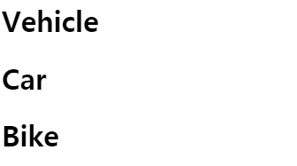

# 5일차

11. 합성 vs 상속
12. React로 생각하기

<br/>

## 11. 합성 vs 상속

### 합성

**합성**이란 서로 다른 객체를 여러개 붙여 새 기능이나 객체를 구성하는 것입니다.  
즉, 부모, 자식 관계가 아닌 것들을 붙여 만든 컴포넌트를 뜻합니다.

- **컴포넌트에서 다른 컴포넌트를 담기**
  
  이는 컴포넌트 안에 다른 컴포넌트들을 배치, 구성하는 방법입니다.

  이때 `props.children`을 사용하여 JSX를 중첩하여 임의의 컴포넌트를 자식으로 전달할 수 있습니다.

  ```jsx
  function FancyBorder(props) {
    return (
      <div className={'FancyBorder FancyBorder-' + props.color}>
        {/* props.children 사용! */}
        {props.children}
      </div>
    );
  }
  ```

  ```jsx
  function WelcomeDialog() {
    return (
      <FancyBorder color="blue">

        {/* 이 부분이 props.children 으로 전달 */}
        <h1 className="Dialog-title">
          Welcome
        </h1>
        <p className="Dialog-message">
          Thank you for visiting our spacecraft!
        </p>
        {/* 여기까지 */}

      </FancyBorder>
    );
  }
  ```

  > 위 예제의 결과는 [링크](https://codepen.io/gaearon/pen/ozqNOV)를 참조하세요

  <br/>

  **React 엘리먼트**는 단지 객체이기 때문에 `props`로 전달할 수 있습니다.  
  아래의 예제로 혹은 좌, 우 배치 등도 아래와 같이 적용할 수 있습니다.

  ```jsx
  function SplitPane(props) {
    return (
      <div className="SplitPane">
        <div className="SplitPane-left">
          {props.left}      {/* <Contacts /> */}
        </div>
        <div className="SplitPane-right">
          {props.right}     {/* <Chat /> */}
        </div>
      </div>
    );
  }

  function App() {
    return (
      {/* props 로 컴포넌트를 넘깁니다. */}
      <SplitPane
        left={
          <Contacts />
        }
        right={
          <Chat />
        }
      />
    );
  }
  ```

  > 위 예제의 결과는 [링크](https://codepen.io/gaearon/pen/gwZOJp?editors=0010)를 참조하세요

<br/>

### 특수화

특수한 컴포넌트를 고려해야하는 경우가 있습니다.  
합성을 통해서 `props`에 따라 컴포넌트의 내용이 결정될 수 있게 할 수 있습니다.

```jsx
function Dialog(props) {
  return (
    <FancyBorder color="blue">
      <h1 className="Dialog-title">
        {props.title}
      </h1>
      <p className="Dialog-message">
        {props.message}
      </p>
    </FancyBorder>
  );
}

function WelcomeDialog() {
  return (
    {/* title 과 message 를 Dialog의 props로 보냅니다. */}
    <Dialog
      title="Welcome"
      message="Thank you for visiting our spacecraft!" />
  );
}
```

<br/>

### 상속

react 에서 컴포넌트를 다른 컴포넌트에 상속할 수 있습니다.

```jsx
class Vehicle extends React.Component{
  constructor(props){
    super(props);
    this.className = 'Vehicle';
  }

  render(args) {
    return (
      <h1 className={this.className}>
        {this.props.children}{args}
      </h1>
    );
  }
}
```

```jsx
// Vehilcle 을 상속
class Car extends Vehicle{
  constructor(props){
    super(props);
  }
}

// Vehilcle 을 상속
class Bike extends Vehicle{
  constructor(props){
    super(props);
  }
}

class Main extends React.Component{
  render(){
    return (
      <React.Fragment>
        <Vehicle>Vehicle</Vehicle>
        <Car>Car</Car>
        <Bike>Bike</Bike>
      </React.Fragment>
    );
  }
}
```

<br/>

<p align="center">
  
</p>

<br/>

<br/>

### 합성 vs 상속

- **합성**
  - 코드의 변경이 상속보다 쉽다.
  - 상속을 사용하기 모호한 경우 사용하는 것이 좋다.
- **상속**
  - 조상이 많아져 복잡해지는 문제가 있다.
  - 최상위 클래스 변경으로 하위 클래스에 전체를 영향을 미친다.
  - 기능 확장의 경우 사용하기 좋다.

> ⚠️ react 에서는 상속 구조로 컴포넌트 작성을 권장하는 사례를 찾지 못했다고 합니다.  
> 계속 상속된 컴포넌트의 경우 조상을 찾기 힘들 수 있습니다.  
> 그에 비해 합성 컴포넌트는 쉽게 컴포넌트를 작성할 수 있습니다.

<br/>

## 12. react로 생각하기

이 장은 react 앱을 설계하기 위한 내용입니다.  
react 앱을 작성기 전 아래와 같은 설계 단계가 [react 공식문서](https://ko.reactjs.org/docs/thinking-in-react.html)에 있습니다.

<br/>

### 1단계 UI를 컴포넌트 계층 구조로 나누기

UI를 컴포넌넌트 계층으로 나누는 단계입니다.  
**단일 책임 원칙**에 의해 하나의 컴포넌트가 한 가지 일을 하도록 분리합니다.

컴포넌트 명은 PhotoShop 레이어명이 될 수 있습니다.

> 💡 **단일 책임 원칙** : 모든 클래스는 하나의 책임만 가지며, 클래스는 그 책임을 완전히 캡슐화해야함

<br/>

### 2단계: react로 정적인 버전 만들기

앱을 실제로 구현해볼 단계입니다.  
`state`를 사용하지 말고 정적으로 구성해 봅니다.

> 📖 `props` vs `state`
>
> `props`와 `state`는 일반 JavaScript 객체이지만 아래와 같은 차이점이 있습니다.
>
> 구분|`props`|`state`
> :--|:--:|:--:
> 부모 컴포넌트에서 초기화 가능? | Yes | No
> 부모 컴포넌트 변경 가능? | Yes | No
> 기본값 설정 가능?  | Yes | Yes
> 내부 컴포넌트 변경 가능? | No | Yes
> 자식 컴포넌트에서 초기화? | Yes | Yes
> 자식 컴포넌트 변경 가능? | Yes | No

<br/>

### 3단계: UI state에 대한 최소한의 (하지만 완전한) 표현 찾아내기

UI를 상호작용하기 위해 데이터 모델을 변경할 수 있는 방법이 필요합니다.  
react에서는 `state`를 통해 변경합니다.  
`state` 개수를 최소화하는 방향으로 설계하는 것이 좋습니다.

`state` 또는 `props` 가 될 데이터를 분류하기 위해 아래와 같이 생각할 수 있습니다.

1. 부모로부터 `props`를 통해 전달 &rarr; `state` 아님
2. 시간이 지나도 변하지 않음 &rarr; `state`가 아님
3. 컴포넌트 안의 다른 `state`나 `props`를 가지고 계산 가능 &rarr; `state` 아님

<br/>

### 4단계: State가 어디에 있어야 할 지 찾기

이전 단계에서 최소한으로 필요한 `state`를 찾았습니다.  
이 단계에서는 어떤 컴포넌트가 `state`를 변경하거나 소유할지를 정해야합니다.

react 는 단방향 데이터 흐름을 가지기 때문에 이를 정하기가 힘들 수 있습니다.  
아래와 같은 방법을 통해 어떤 컴포넌트가 `state`를 변경하거나 소유할지를 정합니다.

- `state`를 렌더링하는 모든 컴포넌트 찾기
- **공동 소유 컴포넌트** 찾기
- 공통 혹은 더 상위에 있는 컴포넌트가 `state`를 가져야 합니다.
  - 만약 적절한 상위 컴포넌트가 없는 경우, `state`를 소유한 컴포넌트를 만들어 상위 계층에 추가

> 💡 **공동 소유 컴포넌트**(*common owner component* )  
> &rarr; 계층 구조 내에서 특정 `state`가 있어야 하는 모든 컴포넌트들의 상위에 있는 하나의 컴포넌트

<br/>

### 5단계: 역방향 데이터 흐름 추가하기

전 단계까지 **하향식 구조**로 `props`, `state` 함수로서 앱을 만들었지만 몇몇의 경우 하위 컴포넌트의 변경이 상위에 영향을 주어야하는 경우도 있습니다.

이는 자식 컴포넌트로 `props`로 부모 컴포넌트의 **콜백** 혹은 `state`를 넘겨줍니다.

<br/>

---

## 예제

[react 공식문서의 예제](https://ko.reactjs.org/docs/thinking-in-react.html)의 예제를 참조했습니다.

### 목표

- **디자인 목업**

<p align="center">
  
</p>

- **JSON API**

  ```js
  [
    {category: "Sporting Goods", price: "$49.99", stocked: true, name: "Football"},
    {category: "Sporting Goods", price: "$9.99", stocked: true, name: "Baseball"},
    {category: "Sporting Goods", price: "$29.99", stocked: false, name: "Basketball"},
    {category: "Electronics", price: "$99.99", stocked: true, name: "iPod Touch"},
    {category: "Electronics", price: "$399.99", stocked: false, name: "iPhone 5"},
    {category: "Electronics", price: "$199.99", stocked: true, name: "Nexus 7"}
  ];
  ```

<br/>

### 예제 - 1단계 UI를 컴포넌트 계층 구조로 나누기

<p align="center">
  
</p>

<br/>

구분|설명
--:|:--
**FilterableProductTable**(🟨) |예시 전체를 포괄합니다.
**SearchBar**(🟦) | 모든 유저의 입력(user input) 을 받습니다.
**ProductTable**(🟩) | 유저의 입력(user input)을 기반으로 데이터 콜렉션(data collection)을 필터링 해서 보여줍니다.
**ProductCategoryRow**(*하늘색* ) | 각 카테고리(category)의 헤더를 보여줍니다.
**ProductRow**(🟥) | 각각의 제품(product)에 해당하는 행을 보여줍니다.

<br/>

계층 구조는 아래와 같습니다.

```text
FilterableProductTable
\_SearchBar
\_ProductTable
    \_ProductCategoryRow
    \_ProductRow
```

<br/>

### 예제 - 2단계: React로 정적인 버전 만들기

`state` 를 사용하지 않은 채로 정적으로 구성합니다.

```jsx
class ProductCategoryRow extends React.Component {
  render() {
    const category = this.props.category;
    return (
      <tr>
        <th colSpan="2">
          {category}
        </th>
      </tr>
    );
  }
}

class ProductRow extends React.Component {
  render() {
    const product = this.props.product;
    const name = product.stocked ?
      product.name :
      <span style={{color: 'red'}}>
        {product.name}
      </span>;

    return (
      <tr>
        <td>{name}</td>
        <td>{product.price}</td>
      </tr>
    );
  }
}

class ProductTable extends React.Component {
  render() {
    const rows = [];
    let lastCategory = null;
    
    this.props.products.forEach((product) => {
      if (product.category !== lastCategory) {
        rows.push(
          <ProductCategoryRow
            category={product.category}
            key={product.category} />
        );
      }
      rows.push(
        <ProductRow
          product={product}
          key={product.name} />
      );
      lastCategory = product.category;
    });

    return (
      <table>
        <thead>
          <tr>
            <th>Name</th>
            <th>Price</th>
          </tr>
        </thead>
        <tbody>{rows}</tbody>
      </table>
    );
  }
}

class SearchBar extends React.Component {
  render() {
    return (
      <form>
        <input type="text" placeholder="Search..." />
        <p>
          <input type="checkbox" />
          {' '}
          Only show products in stock
        </p>
      </form>
    );
  }
}

class FilterableProductTable extends React.Component {
  render() {
    return (
      <div>
        <SearchBar />
        <ProductTable products={this.props.products} />
      </div>
    );
  }
}
```

```jsx
const PRODUCTS = [
  {category: 'Sporting Goods', price: '$49.99', stocked: true, name: 'Football'},
  {category: 'Sporting Goods', price: '$9.99', stocked: true, name: 'Baseball'},
  {category: 'Sporting Goods', price: '$29.99', stocked: false, name: 'Basketball'},
  {category: 'Electronics', price: '$99.99', stocked: true, name: 'iPod Touch'},
  {category: 'Electronics', price: '$399.99', stocked: false, name: 'iPhone 5'},
  {category: 'Electronics', price: '$199.99', stocked: true, name: 'Nexus 7'}
];
 
ReactDOM.render(
  <FilterableProductTable products={PRODUCTS} />,
  document.getElementById('container')
);
```

<br/>

### 예제 - 3단계: UI state에 대한 최소한의 (하지만 완전한) 표현 찾아내기

애플리케이션에서 필요로 하는 변경 가능한 `state`의 최소 집합을 생각합니다.

이 애플리케이션에서 필요한 데이터는 아래와 같습니다.

- **제품의 원본 목록**
  - props를 통해 전달 &rarr; `state` 아님
- **유저가 입력한 검색어**
  - 시간에 따라 변하기도 하면서 다른 컴포넌트에 의해 계산 안됨 &rarr; `state`
- **체크박스의 값**
  - 시간에 따라 변하기도 하면서 다른 컴포넌트에 의해 부터 계산 안됨 &rarr; `state`
- **필터링 된 제품들의 목록**
  - 제품의 원본 목록과 검색어, 체크박스의 값을 조합해서 계산 &rarr; `state` 아님

<br/>

### 예제 - 4단계: State가 어디에 있어야 할 지 찾기

어떤 컴포넌트가 `state`를 소유할지 찾습니다.

- `<ProductTable>` 은 `state`에 의존한 _상품 리스트_ 를 필터링해야합니다.  
- **공동 소유 컴포넌트**는 `<FilterableProductTable>` 입니다.
- 의미상으로도 `<FilterableProductTable>` 이 검색어와 _체크박스의 체크 여부_ 를 가지는 것이 타당

따라서 `<FilterableProductTable>` 가 `state`를 가져야 합니다.

```jsx
class FilterableProductTable extends React.Component {
  constructor(props) {
    super(props);

    // state 를 갖습니다.
    this.state = {
      filterText: '',
      inStockOnly: false
    };
  }

  render() {
    return (
      <div>
        <SearchBar
          filterText={this.state.filterText}
          inStockOnly={this.state.inStockOnly}
        />
        <ProductTable
          products={this.props.products}
          filterText={this.state.filterText}
          inStockOnly={this.state.inStockOnly}
        />
      </div>
    );
  }
}
```

<br/>

### 예제 - 5단계: 역방향 데이터 흐름 추가하기

계층 구조의 하단에 있는 폼 컴포넌트에서 `<FilterableProductTable>`의 `state`를 업데이트할 수 있어야 합니다.

```jsx
class FilterableProductTable extends React.Component {
  constructor(props) {
    super(props);
    this.state = {
      filterText: '',
      inStockOnly: false
    };
    
    // 자식 컴포넌트로 보낼 제어 함수, 검색바 입력 제어
    this.handleSearchBar = this.handleSearchBar.bind(this);

    // 자식 컴포넌트로 보낼 제어 함수, 체크 박스 제어
    this.handleInStockOnly = this.handleInStockOnly.bind(this);
  }
  
  handleSearchBar(event) {
    this.setState({ filterText: event.target.value });
  }
  
  handleInStockOnly(newValue) {
     this.setState({ inStockOnly: newValue });
  }

  render() {
    return (
      <div>
        <SearchBar
          filterText={this.state.filterText}
          inStockOnly={this.state.inStockOnly}
          handleSearchBar={this.handleSearchBar}
          handleInStockOnly={this.handleInStockOnly}
        />
        <ProductTable
          products={this.props.products}
          filterText={this.state.filterText}
          inStockOnly={this.state.inStockOnly}
        />
      </div>
    );
  }
}
```

```jsx
class SearchBar extends React.Component {
  render() {
    const filterText = this.props.filterText;
    const inStockOnly = this.props.inStockOnly;

    return (
      <form>
        {/* onChange 에 this.props.handleSearchBar 전달  */}
        <input
          type="text"
          placeholder="Search..."
          value={filterText}
          onChange={(e) => this.props.handleSearchBar(e)}
         />
        <p>
          {/* onChange 에 this.props.handleInStockOnly 전달  */}
          <input
            type="checkbox"
            checked={inStockOnly}
            onChange={() => this.props.handleInStockOnly(!inStockOnly)} 
          />
          {' '}
          Only show products in stock
        </p>
      </form>
    );
  }
}
```
