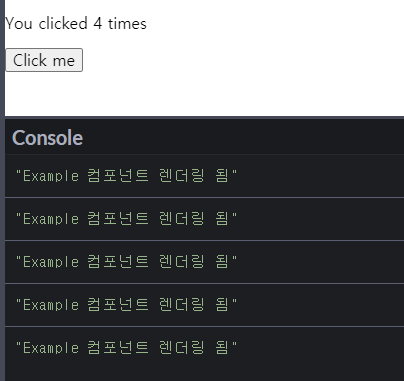
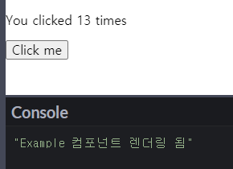
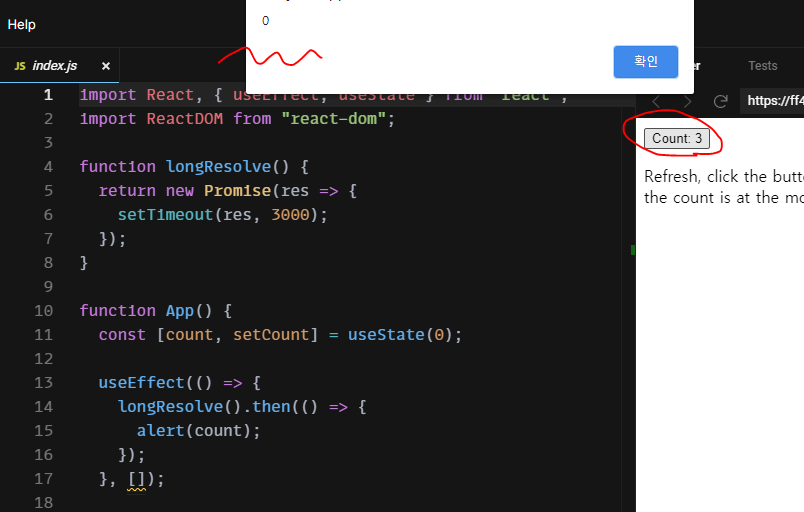
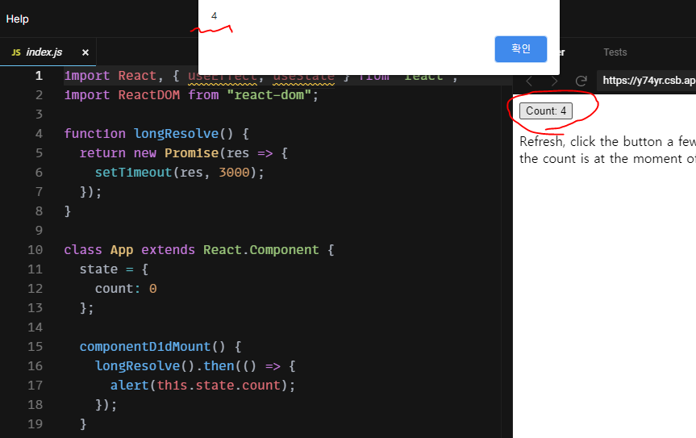
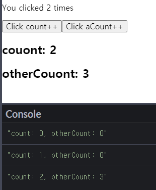

# 6일차(Hook)

**Hook**을 정리

## 1. Hook 소개

### Hook?

**Hook** 이란 함수 컴포넌트로 `class` 없이 React를 사용할 수 있게 해주는 것입니다.  
**Hook**을 이용함으로서 `props`, `state`, **context**, **refs**, 그리고 **lifecycle**와 같은 React 개념에 좀 더 직관적인 API를 제공합니다.

특징은 아래와 같습니다.

- 기존의 코드 틀 안에서 다시 작성할 필요 없이 **Hook**을 선택적으로 사용 가능
- **Hook**은 `100%` 이전 버전과의 호환성을 가짐
- **Hook** 이름은 항상 `use`로 시작합니다.
- React _버전 16.8_ 에 새로 추가됨

> ⚠️ **Hook**은 `class` 안에서는 동작하지 않습니다.

<br/>

### 동기

- 컴포넌트 사이에서 상태와 관련된 로직 재사용이 어려움
  - **Hook**은 계층 변화 없이 상태 관련 로직을 재사용할 수 있도록 도와줍니다
  
- 복잡한 컴포넌트들은 이해하기 어려움
  - **Hook**을 통해 로직에 기반한 작은 함수로 컴포넌트를 나눌 수 있습니다.
  
- 클래스 컴포넌트가 코드의 재사용성과 코드 구성을 어렵게 만듦
  - **Hook**을 사용해 `class` 없이 react 기능을 사용할 수 있습니다.

<br/>

### Hook 사용 규칙

**Hook**은 2가지 규칙을 준수해야합니다.

- 최상위(_at the top level_ )에서만 **Hook**을 호출해야합니다.
  - 반복문, 조건문, 중첩된 함수내에서는 **Hook**을 사용하면 안됩니다.
- react 함수 컴포넌트 내에서만 **Hook**을 호출 해야합니다.
  - 일반 JavaScript 함수에서 **Hook**을 호출하면 안됩니다.
  - 그러나 **custom Hook** 안에서는 **Hook** 호출이 가능합니다.

> ⚠️ **react는 최상위에 Hook을 호출하지 않는 경우, 잘못된 결과를 초래합니다.**  
> 왜냐하면 react가 **Hook**이 호출되는 순서에 의존하기 때문입니다.  
>
> react는 **Hook의 호출순**으로 특정 `state` 가 어떤 `useState` 호출에 해당하는지 확인합니다.
>
> ```jsx
> function Form() {
>   // name이라는 state 변수를 사용
>   const [name, setName] = useState('Mary');
> 
>   /* ====================== 🔴 Hook을 건너뛰었습니다! ====================== */
>   if(false) {                                                   
>     // Effect를 사용해 폼 데이터를 저장
>     useEffect(function persistForm() {
>       localStorage.setItem('formData', name);
>     });
>   }
>   
>   /* ============ 🔴 surname state 변수를 읽는 데 실패했습니다. ============ */
>   // surname이라는 state 변수를 사용
>   const [surname, setSurname] = useState('Poppins');
> 
>   /* ===== 🔴 제목을 업데이트하기 위한 effect가 대체되는 데 실패했습니다. ===== */
>   // Effect를 사용해서 title 를 업데이트
>   useEffect(function updateTitle() {
>     document.title = name + ' ' + surname;
>   });
> 
>   // ...
> }
> ```
>
> 위에서 지역에 최상위에 **Hook**을 호출하지 않았으며 **Hook**을 건너뛴 부분이 존재합니다.  
> 이로 인해 **Hook**의 호출 순서가 달라지게 됩니다.  
> react는 두번째 `useEffect()` 호출이 나올 것으로 예상했지만 `useState('Poppins')` 호출됨으로서 버그가 발생됩니다.

<br/>

## State Hook

### State Hook - 개요

**클래스 컴포넌트**에서 `state` 는 `setState()` 를 이용하여 변경합니다.  
그런데 **함수 컴포넌트**에서는 어떻게 할까요?

이는 **State Hook**을 사용하는 것입니다.  
**State Hook**을 이용하여 함수 컴포넌트에서 `state`와 `setState()`를 정의하게 해줍니다.

```jsx
// react 에서 useState 를 import 해야합니다.
import React, { useState } from 'react';

function Example {
  // ES6의 배열 구조 분해(destructuring) 사용
  const [STATE_명, setSTATE_명] = useState(초기_STATE_값)

  /* 여러개의 State Hook을 사용할 수 있습니다. */
  const [STATE_1, setSTATE_1] = useState(1);
  const [STATE_2, setSTATE_2] = useState(2);
  // ...
}
```

> 💡 `useState()` 는 `[STATE, SET_STATE_함수]` 를 반환하기 때문에 ES6의 **배열 구조 분해**(*destructuring* ) 사용하여 변수에 치환합니다.

<br/>

> 📖 **배열 구조 분해(destructuring) 문법**
>
> ES6 의 문법으로 배열, 객체의 속성을 해체하여 그 값을 변수에 담을 수 있게하는 표현식 입니다.
>
> ```js
> [a, b, ...rest] = [10, 20, 30, 40, 50];
> 
> console.log(rest);  // Array [30,40,50] 출력
> ```

<br/>

`useState()` 예제는 아래와 같습니다.

```jsx
import React, { useState } from 'react';

function Example() {
  // const 라는 state 생성
  // setCount() 라는 setState() 생성
  // count는 0으로 초기화
  const [count, setCount] = useState(0);

  return (
    <div>
      <p>You clicked {count} times</p>
      {/* 클래스 컴포넌트와 달리 this를 호출하지 않아도 됩니다. */}
      <button onClick={() => setCount(count + 1)}>
        Click me
      </button>
    </div>
  );
}
```

<br/>

> 📖 `useState()` vs `this.state`
>
> `state` 변화시 병합하여 아래와 같이 동작합니다.
>
> - `useState`: 변화된 `state`를 _대체_ 함
> - `this.state`: 변화된 `state`를 갱신 혹은 병합함

<br/>

## Effect Hook

### Effect Hook - 개요

**Effect Hook**이란 컴포넌트가 렌더링 이후에 어떤 일을 수행해야하는 지 설정하는 **Hook** 입니다.  

- DOM 업데이트 한 뒤 추가로 코드를 실행합니다. (**side effects** 필요시 해당 코드 실행)
- 기본적으로 React는 매 렌더링 이후에 **Effect Hook**을 실행
- 함수 컴포넌트에서 react의 **생명주기 메서드** 처럼 사용할 수 있습니다.
  - `componentDidMount()`
  - `componentDidUpdate()`
  - `componentWillUnmount()`
- 한 컴포넌트 안에 `useEffect()` 를 여러번 사용할 수 있습니다.

<br/>

> 💡 **side effects**
>
> react에서 **side effects**는 아래 사항에 따라 다른 컴포넌트에게 영향을 주는 것입니다.
>
> - 데이터 가져오기
> - **구독**(_subscription_ ) 설정하기
>   - **구독**은 데이터의 변화에 따라 실행되는 것을 의미합니다.
> - 수동으로 리액트 컴포넌트의 DOM을 수정

<br/>

기본적인 `useEffect()`는 아래와 같이 사용합니다.

```jsx
import React, {useEffect} from "react";

function MyComponent(props) {
  /* 렌더링시 콜백을 실행 */
  useEffect(
    콜백
  )
}
```

`useEffect()` 예제는 아래와 같습니다.

```jsx
import React, { useState, useEffect } from 'react';

function Example() {
  const [count, setCount] = React.useState(0);

  // componentDidMount, componentDidUpdate와 처럼
  // 렌더링시 콜백을 실행합니다.
  React.useEffect(() => {
    console.log("Example 컴포넌트 렌더링 됨");
  });

  return (
    <div>
      <p>You clicked {count} times</p>
      <button onClick={() => setCount(count + 1)}>
        Click me
      </button>
    </div>
  );
}
```

위 예제에서 클릭시 `count` 값이 변경될 때마다 렌더링이 됩니다.  
이때마다 `useEffect()`의 콜백이 실행됩니다.

<br/>

<p align="center">
  
</p>

<br/>

`처음 렌더링할 때 1번 + 클릭 4번(때마다 렌더링)` &rarr; `console.log()`가 5번 출력됩니다.

> 📖 `state`가 자주 바뀔 때 `useEffect`은 어떻게 사용해야할까요?
> 
> 너무 `state` 가 변경어 `useEffect` 에 영향을 주는 경우 `setState` 함수에서 이전 `state`를 사용하여 값을 설정할 수 있습니다.
>
> ```jsx
> function Counter() {
>   const [count, setCount] = useState(0);
> 
>   useEffect(() => {
>     const id = setInterval(() => {
>       // setState() 처럼 
>       setCount(c => c + 1);             // ✅ count 변수에 종속적이지 않게 함
>     }, 1000);
>     return () => clearInterval(id);
>   }, []);                               // ✅ effect가 컴포넌트 지역 안의 변수를 사용하지 않습니다.
> 
>   return <h1>{count}</h1>;
> }
> ```

<br/>

### 생명주기 처럼 useEffect 사용

함수 컴포넌트 안에서 `useEffect()` 를 이용하여 생명주기 메서드처럼 사용할 수 있습니다.

<br/>

- `componentDidMount()` 처럼
  - 컴포넌트 **마운트**시 `콜백`을 실행합니다.
  - 컴포넌트 당 한번씩만 실행합니다.
  - 인자로 `콜백`, `[]`을 전달해야합니다.
  - 전달된 `[]`을 **의존성 배열**이라고 합니다.

    ```jsx
    // 두번째 인자로 빈 배열을 전달해야합니다.
    useState(
      콜백,
      []
    )
    ```

    ```jsx
    function Example() {
      const [count, setCount] = useState(0);

      // 마운트시 콜백을 실행합니다.
      useEffect(() => {
        console.log("Example 컴포넌트 렌더링 됨");
      }, []);

      return (
        <div>
          <p>You clicked {count} times</p>
          <button onClick={() => setCount(count + 1)}>
            Click me
          </button>
        </div>
      );
    }
    ```

    위의 예제와 달리 마운트시에만 `콜백`을 실행합니다.

    <br/>

    <p align="center">
      
    </p>

    <br/>

    > 📖 `useEffect()` vs `componentDidMount()`
    >
    > `useEffect`는 `props`, `state`를 **캡쳐**(**클로저** 때문에 값을 유지)할 수 있다.  
    > (아래 2개의 예제에서 버튼을 클릭해보세요)
    >
    > - [useEffect 예제](https://codesandbox.io/s/bold-sinoussi-ff42j?file=/src/index.js)
    > - [componentDidMount 예제](https://codesandbox.io/s/sleepy-leftpad-y74yr)
    >
    > - **useEffect 결과**
    >
    >   
    >
    > - **componentDidMount 결과**
    >
    >   
    >
    > 더 자세한 내용은 [원문](https://reacttraining.com/blog/useEffect-is-not-the-new-componentDidMount/#capturing-props-and-state)을 참조

<br/>

- `componentDidUpdate()` 처럼
  - 컴포넌트가 렌더링 할 때마다 `콜백`을 실행합니다.
  - `콜백`만 인자로 전달합니다.
  - `콜백` 안의 `state` 가 달라지면 `콜백`을 실행합니다.

    ```jsx
    // state1, state2가 바뀌면 콜백을 실행합니다.
    useState(
      콜백,
      [state1, state2, ...]
    )
    ```

    > ⚠️ 의존성 배열에 해당 `state`를 넣어도 빈 배열(`[]`)을 넣어도 컴포넌트 마운트시 `콜백`을 실행합니다.

<br/>

- `componentWillUnmount()` 처럼
  - 컴포넌트가 **언마운트**(삭제)시에 `콜백`을 실행합니다.
  - `useEffect()`의 `콜백`의 `return 문`에 **언마운트**시 실행할 **함수**를 작성합니다.

    ```jsx
    useState(
      () => {
        // ...
    
        // 언마운트 시 실행되는 함수를 return 문에 작성해야합니다.
        return () => {
          // ...
        }
      }
    )
    ```

<br/>

> 💡 **의존성 배열**
> 
> `useEffect()` 의 인자로 보내는 배열은 **의존성 배열**(배열 안의 변수의 값 변화에 의존) 이라고 합니다.  
> **의존성 배열**은 아래와 같은 의미를 나타냅니다.
>
> - `useEffect(callback, [])`
>   - 마운트시 한번만 `callback` 을 수행
>   - 초기의 `props`와 `state`를 유지
> - `useEffect(callback, [arg1, arg2, ...])`

<br/>

### 성능 최적화

`useEffect()`을 사용하면 랜더링 마다 성능 이슈가 생길 수도 있습니다.  
**의존성 배열**을 추가하여 해당 `state` 변화를 감지하여 해당 컴포넌트의 랜더링 여부를 결정합니다.

이 경우에는 아래와 같이 필요한 `state`의 변경시에만 컴포넌트의 렌더링을 할 수 있습니다.

- **클래스 컴포넌트**의 경우

    ```jsx
    // preProps: 이전 props
    // preState: 이전 state
    componentDidUpdate(prevProps, prevState) {
      if (prevState.count !== this.state.count) {
        document.title = `You clicked ${this.state.count} times`;
      }
    }
    ```

- **함수 컴포넌트**의 경우

    `useEffect(콜백, [변경감지할_state])` 형식으로 사용합니다.

    ```jsx
    // useEffect 를 이용합니다.
    useEffect(() => {
      document.title = `You clicked ${count} times`;
    }, [count]); // count가 바뀔 때만 effect를 재실행합니다.
    ```

<br/>

> ⚠️ `useEffect()` 의 콜백에서 참조되는 모든 값은 의존성 값의 배열에 드러나야 합니다.
>
> ```jsx
> function Example() {
>   const [count, setCount] = React.useState(0);
>   const [otherCount, setOtherCount] = React.useState(0);
> 
>   React.useEffect(() => {
>     console.table(`count: ${count}, otherCount: ${otherCount}`);
>     // 의존성 배열에 count 만 있으면 otherCount의 변화로
>     // 이 콜백이 실행되지 않습니다.
>   }, [count]);
> 
>   return (
>     <div>
>       <p>You clicked {count} times</p>
>       <button onClick={() => setCount(count + 1)}>
>         Click count++
>       </button>
>       <button onClick={() => setOtherCount(otherCount + 1)}>
>         Click aCount++
>       </button>
>       <div>
>         <h2>couont: {count}</h2>
>         <h2>otherCouont: {otherCount}</h2>
>       </div>
>     </div>
>   );
> }
> ```
>
> <br/>
>
> <p align="center">
>   
> </p>
>
> `count` 값이 변할때만 `useEffect()`의 콜백이 실행됩니다.

<br/>

## Custom Hook

자신만의 **Hook**을 작성할 수 있습니다.
이렇게 **Custom Hook**을 작성하는 경우는 2개의 JS 파일에서 같은 로직을 공유할 때 사용합니다.

<br/>

```jsx
// FriendStatus.js

import React, { useState, useEffect } from "react";

// 커스텀 훅을 모듈로 export
export default function createMyHook(friendID) {
  const [isOnline, setOnline] = useState(null);

  // ...

  // 로그인 유무 반환
  return isOnline;
}
```

```js
// ohter_1.js

import React from "react";
import useFriendStatus from "FriendStatus";

function FriendStatus(props) {
  // props.friend.id 의 로그인 상태
  const isOnline = useFriendStatus(props.friend.id);

  if (isOnline === null) {
    return 'Loading...';
  }
  return isOnline ? 'Online' : 'Offline';
}
```

```jsx
// other_2.js

function FriendListItem(props) {
  // props.friend.id 의 로그인 상태
  const isOnline = useFriendStatus(props.friend.id);

  return (
    <li style={{ color: isOnline ? 'green' : 'black' }}>
      {props.friend.name}
    </li>
  );
}
```

또한 **Hook** 과 **Hook** 사이에 정보를 전달할 수도 있습니다.

```jsx
const friendList = [
  { id: 1, name: 'Phoebe' },
  { id: 2, name: 'Rachel' },
  { id: 3, name: 'Ross' },
];

function ChatRecipientPicker() {
  const [recipientID, setRecipientID] = useState(1);

  // state인 recipietID 를 커스텀 훅으로 전달
  const isRecipientOnline = useFriendStatus(recipientID);

  return (
    <>
      <Circle color={isRecipientOnline ? 'green' : 'red'} />
      <select
        value={recipientID}
        onChange={e => setRecipientID(Number(e.target.value))}
      >
        {friendList.map(friend => (
          <option key={friend.id} value={friend.id}>
            {friend.name}
          </option>
        ))}
      </select>
    </>
  );
}
```

<br/>

> ⚠️ **같은 Hook을 사용하는 두 개의 컴포넌트는 state를 공유?**
>
> 아니요. **Custom Hook**은 상태 관련 로직(구독을 설정하고 현재 변숫값을 기억하는 것)을 재사용하는 메커니즘이지만  
> **Custom Hook**을 사용할 때마다 각각 그 안의 `state`와 `effect`는 완전히 독립적 입니다.

<br/>

> 📖 Custom Hook 을 작성할 때 `use`로 시작하는 이름을 사용해야 _linter 플러그인_ 이 해당 Hook을 인식하고 버그를 찾을 수 있습니다.

<br/>

## 유용한 Hook들

### useContext

```jsx
const value = useContext(MyContext);
```

**context 객체**(`React.createContext`에서 반환된 값)을 받아 그 context의 현재 값을 반환합니다.

**context 객체**를 사용해 react 컴포넌트 트리 안에서 전역적(global)이라고 볼 수 있는 데이터를 공유할 수 있습니다.  
(실제로는 해당 Context의 가장 가까운 `Provider`를 찾아 그 값을 읽습니다.)

따라서 **하향식 데이터 흐름**을 **양방향**으로 바꿀 수 있습니다.

```js
const themes = {
  light: {
    foreground: "#000000",
    background: "#eeeeee"
  },
  dark: {
    foreground: "#ffffff",
    background: "#222222"
  }
};
```

```js
import React from "react"

// context 객체 생성
const ThemeContext = React.createContext(themes.light);

function App() {
  return (
    {/* Context.Provider 의 value 속성으로 공유할 변수를 지정합니다. */}
    {/* Provider는 context를 구독하는 컴포넌트들에게 context의 변화를 알리는 역할 수행 */}
    <ThemeContext.Provider value={themes.dark}>
      <Toolbar />
    </ThemeContext.Provider>
  );
}
```

```jsx

function Toolbar(props) {
  return (
    <div>
      <ThemedButton />
    </div>
  );
}

function ThemedButton() {
  // 
  const theme = useContext(ThemeContext);
  return (
    <button style={{ background: theme.background, color: theme.foreground }}>
      I am styled by theme context!
    </button>
  );
}
```

> ⚠️ `useContext()`를 호출한 컴포넌트는 `context` 가 변경될 때 마다 항상 리렌더링 됩니다.

> 📖 **Context**에 대한 더 자세한 정보는 [공식문서](https://ko.reactjs.org/docs/context.html)를 참고하세요

<br/>

### useRef

```jsx
const refContainer = useRef(initialValue);
```

`useRef()`는 `.current` 프로퍼티로 전달된 인자(initialValue)로 초기화된 변경 가능한 **ref 객체**를 반환합니다.

**ref객체**는 `render()` 메서드에서 생성된 **DOM 노드**나 **React 엘리먼트**에 접근 가능하게 합니다.

```jsx
function TextInputWithFocusButton() {
  const inputEl = useRef(null);
  const onButtonClick = () => {
    // .current 는 input element 을 가리키게 됩니다.
    // .focus() : 포커스 상태로 만든다.
    inputEl.current.focus();
  };
  return (
    <>
      {/* ref를 설정 */}
      <input ref={inputEl} type="text" />
      <button onClick={onButtonClick}>Focus the input</button>
    </>
  );
}
```

> 💡 함수 컴포넌트는 인스턴스가 없기 때문에 함수 컴포넌트에 **ref 어트리뷰트**를 사용할 수 없습니다.  
> 따라서 `useRef()`를 사용합니다.

<br/>

> ⚠️ **`useRef` 의 주의점**
>
> `useRef`는 내용이 변경될 때 그것을 알려주지는 않는다는 것을 유념하세요.  
> `.current` 프로퍼티를 변형하는 것이 리렌더링을 발생시키지는 않습니다.

<br/>

### useMemo

```jsx
// 첫번째 인자 : 연산을 정의하는 함수
// 두번째 인자 : 기존 결과값 재활용 여부 기준되는 입력값
const memoizedValue = useMemo(() => computeExpensiveValue(a, b), [a, b]);
```

**메모이제이션** 된 값을 반환합니다.

두번째 배열 안에 넣은 내용이 바뀌면, 우리가 등록한 함수를 호출해서 값을 연산합니다.  
만약에 내용이 바뀌지 않았다면 이전에 연산한 값을 재사용합니다.

- `useMemo`로 전달된 함수는 렌더링 중에 실행
  - 함수에 렌더링 중 하면 안되는 코드를 사용하면 안됩니다.
- useMemo는 성능 최적화를 위해 사용할 수 있지만 의미상으로 보장하지는 않습니다.

<br/>

> 💡 **메모이제이션**
>
> 동일한 계산을 반복해야 할 때, 이전에 계산한 값을 메모리에 저장함으로써  
> 동일한 계산의 반복 수행을 제거하여 프로그램 실행 속도를 빠르게 하는 기술
